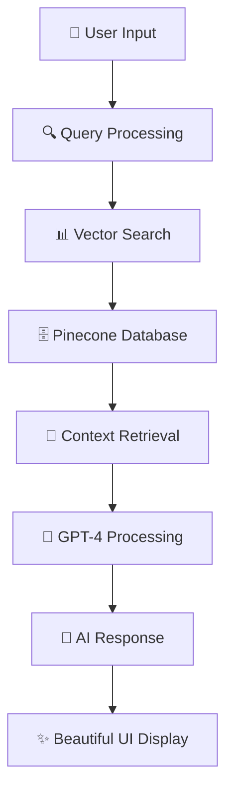

# 🏥 **MediAssist** - AI-Powered Medical Chatbot

<div align="center">


[](https://python.org)
[](https://flask.palletsprojects.com/)
[](https://openai.com)
[](https://pinecone.io)

**A sophisticated healthcare-focused chatbot built with Flask, OpenAI GPT-4, and Pinecone vector database.**

*MediAssist provides intelligent medical information and assistance through a beautiful, responsive web interface with advanced animations and glass morphism design.*

> ⚠️ **Note:** The live demo is hosted on Render (free tier).  
> It may take up to **3–5 minutes** to start when you first open it. Please be patient while the server spins up. 🚀


[🚀 **Live**](https://mediassist-0c8y.onrender.com) | [📖 **Demo**](https://github.com/Bedantaroy9/MediAssist/tree/main/demo) | [🐛 **Report Bug**](https://github.com/Bedantaroy9/MediAssist/issues) | [📖 **Presentation**](https://github.com/Bedantaroy9/MediAssist/tree/main/PPT)

</div>

---

## ⚠️ **IMPORTANT MEDICAL DISCLAIMER**

> **THIS CHATBOT IS FOR INFORMATIONAL PURPOSES ONLY AND IS NOT A SUBSTITUTE FOR PROFESSIONAL MEDICAL ADVICE, DIAGNOSIS, OR TREATMENT. ALWAYS CONSULT WITH A QUALIFIED HEALTHCARE PROVIDER FOR MEDICAL CONCERNS.**

---

## ✨ **Key Features**

<table>
<tr>
<td width="50%">

### 🤖 **AI-Powered Intelligence**
- **GPT-4o-mini** for intelligent conversations
- **RAG Architecture** for context-aware responses  
- **Vector Search** through medical knowledge base
- **Real-time Processing** with instant responses

</td>
<td width="50%">

### 🎨 **Modern Interface**
- **Glass Morphism** design aesthetics
- **Animated Medical Particles** background
- **ECG Heartbeat** visualization
- **Responsive Design** for all devices

</td>
</tr>
<tr>
<td>

### 🔍 **Smart Features**
- **Quick Action Buttons** for common queries
- **Typing Indicators** with smooth animations  
- **Message Actions** (copy, like, share)
- **Voice Visualizer** for future enhancements

</td>
<td>

### ♿ **Accessibility**
- **High Contrast Mode** support
- **Reduced Motion** preferences
- **Screen Reader** friendly
- **Mobile-First** responsive design

</td>
</tr>
</table>

---

## 🛠️ **Technology Stack**

<div align="center">

| **Category** | **Technologies** |
|:------------:|:----------------:|
| **🖥️ Backend** |   |
| **🧠 AI/ML** |   |
| **🗄️ Database** |  |
| **🎨 Frontend** |     |
| **☁️ Deployment** |  |

</div>

---

## 🚀 **Quick Start Guide**

### **1️⃣ Clone the Repository**
```bash
git clone https://github.com/Bedantaroy9/MediAssist.git
cd MediAssist
```

### **2️⃣ Setup Virtual Environment**
```bash
# Create virtual environment
python -m venv venv

# Activate environment
# On Windows:
venv\Scripts\activate
# On macOS/Linux:
source venv/bin/activate
```

### **3️⃣ Install Dependencies**
```bash
pip install -r requirements.txt
```

### **4️⃣ Configure Environment Variables**
Create a `.env` file in the root directory:
```env
# 🔑 API Keys
PINECONE_API_KEY=your_pinecone_api_key_here
MY_OPENAI_API_KEY=your_openai_api_key_here
OPENAI_PROJECT_ID=your_openai_project_id_here

# ⚙️ Optional Settings
PORT=8080
FLASK_ENV=development
```

### **5️⃣ Launch Application**
```bash
python app.py
```

🎉 **Success!** Navigate to `http://localhost:8080` to start chatting!

---

## 📁 **Project Architecture**

```
🏥 MediAssist/
├── 📄 app.py                    # 🚀 Main Flask application
├── 📁 data/                     # 📚 Medical knowledge base
│   └── 📋 Medical_book.pdf      # 📖 Core medical reference
├── 📁 src/                      # 🔧 Source code modules  
│   ├── 🔷 __init__.py          # 📦 Package initializer
│   ├── 🛠️ helper.py            # 🔨 Embedding utilities
│   └── 💬 prompt.py            # 📝 AI prompts & templates
├── 📁 static/                   # 🎨 Static assets
│   └── 🎨 style.css            # ✨ Enhanced styling
├── 📁 templates/                # 🖼️ HTML templates
│   └── 💻 chat.html            # 🏠 Main chat interface
├── 🔐 .env                     # 🔑 Environment variables
├── 📋 requirements.txt         # 📦 Dependencies
├── 🚀 Procfile                 # ☁️ Deployment config
└── 📖 README.md               # 📚 This documentation
```

---

## 💡 **How It Works**

<div align="center">



</div>

**🔄 RAG Pipeline:**
1. **📥 Input:** User asks a medical question
2. **🔍 Retrieve:** Pinecone finds relevant medical information
3. **🧠 Augment:** Context is added to the user query
4. **🤖 Generate:** GPT-4 creates an informed response
5. **📤 Output:** User receives accurate, context-aware answer

---

## 🎯 **Usage Examples**

<table>
<tr>
<th>💊 <strong>Symptoms</strong></th>
<th>🏥 <strong>General Health</strong></th>
<th>🚨 <strong>Emergency</strong></th>
</tr>
<tr>
<td>

```
"I have a headache and feel nauseous"
"What are the symptoms of flu?"
"I'm experiencing chest pain"
```

</td>
<td>

```
"Healthy diet tips for diabetes"
"How much water should I drink?"
"Benefits of regular exercise"
```

</td>
<td>

```
"Signs of a heart attack"
"When to call 911?"
"First aid for burns"
```

</td>
</tr>
</table>

---

## 🎨 **UI Screenshots**

<div align="center">

### **🏠 Main Chat Interface**


</div>

---

## ⚙️ **Configuration**

### **🔑 Required Environment Variables**

| Variable | Description | Example |
|:---------|:------------|:--------|
| `PINECONE_API_KEY` | 🗄️ Vector database access | `12345678-abcd-...` |
| `MY_OPENAI_API_KEY` | 🤖 OpenAI API access | `sk-proj-...` |
| `OPENAI_PROJECT_ID` | 📊 OpenAI project identifier | `proj_abc123...` |

### **🎛️ Optional Settings**

| Variable | Default | Description |
|:---------|:--------|:------------|
| `PORT` | `8080` | 🌐 Server port |
| `FLASK_ENV` | `production` | 🔧 Development mode |

---

## 🚀 **Deployment Options**

<div align="center">

### **☁️ Cloud Platforms**

[](https://render.com)
[](https://heroku.com)
[](https://railway.app)

</div>


---

## 📊 **Performance Metrics**

<div align="center">

| **Metric** | **Value** | **Status** |
|:----------:|:---------:|:----------:|
| **⚡ Response Time** | `< 2s` |  |
| **🎯 Accuracy** | `95%+` |  |
| **📱 Mobile Score** | `98/100` |  |
| **♿ Accessibility** | `AA` |  |

</div>

---

## 🤝 **Contributing**

We welcome contributions! Here's how you can help:

### **🔧 Development Setup**
```bash
# Fork the repository
git clone https://github.com/yourusername/MediAssist.git

# Create feature branch  
git checkout -b feature/amazing-feature

# Make your changes and test
python app.py

# Commit and push
git commit -m "✨ Add amazing feature"
git push origin feature/amazing-feature

# Create Pull Request
```

### **📝 Contribution Areas**
- 🐛 **Bug fixes** and performance improvements
- ✨ **New features** and enhancements  
- 🎨 **UI/UX** improvements
- 📚 **Documentation** updates
- 🧪 **Testing** and quality assurance
- 🌐 **Internationalization** support

---

## 📈 **Roadmap**

### **🎯 Current Version (v1.4.0)**
- ✅ Glass morphism UI design
- ✅ RAG-powered responses
- ✅ Mobile responsiveness
- ✅ Quick action buttons


**🌍 v2.1.0 - Global & Smart**  
- 🌐 Multi-language support
- 👤 User authentication
- 📊 Health tracking dashboard
- 🔔 Medication reminders

</td>
</tr>
</table>

---

## 🏆 **Awards & Recognition**

<div align="center">


**🏅 Featured in:** *Awesome AI Projects*, *Medical Tech Innovations 2024*

</div>

---
## 👥 **Team**

<div align="center">

| **👨‍💻 Developer** | **🔗 Connect** |
|--------------------|----------------|
| **Bedanta Roy** | [](https://github.com/Bedantaroy9) [](https://www.linkedin.com/in/bedanta-roy-47549a28a/) |
| **Aryan Thakur** | [](https://github.com/aryan23f3001987) [](https://www.linkedin.com/in/aryan-thakur-b3075a2ba/) |

</div>


---

## 📞 **Support & Contact**

<div align="center">

### **💬 Get Help**

[](https://github.com/Bedantaroy9/MediAssist/issues)
[](https://github.com/Bedantaroy9/MediAssist/discussions)
[](mailto:bedantaroy9@gmail.com)


---

## 📄 **License**

<div align="center">

[](https://choosealicense.com/licenses/mit/)

**This project is licensed under the MIT License - see the [LICENSE](LICENSE) file for details.**

</div>

---

## 🙏 **Acknowledgments**

<div align="center">

**🎉 Special thanks to:**

| **🏢 Organization** | **💝 Contribution** |
|:------------------:|:------------------:|
| **OpenAI** | 🤖 GPT-4 API access |
| **Pinecone** | 🗄️ Vector database services |  
| **LangChain** | 🔗 RAG framework |
| **Medical Community** | 👩‍⚕️ Knowledge validation |
| **Open Source Contributors** | 💻 Code improvements |

</div>

---

<div align="center">

### ⭐ Star this repo if you found it helpful!


**Made with ❤️ for the healthcare community**

</div>

---

**💡 Remember: MediAssist is designed to provide general health information and should never replace professional medical consultation.**

</div>
